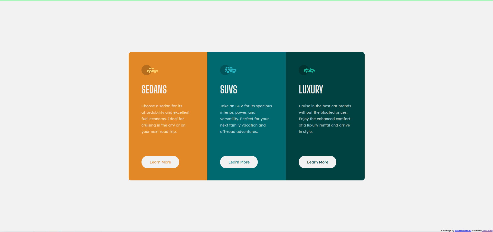

# Frontend Mentor - 3-column preview card component solution

This is a solution to the [3-column preview card component challenge on Frontend Mentor](https://www.frontendmentor.io/challenges/3column-preview-card-component-pH92eAR2-). Frontend Mentor challenges help you improve your coding skills by building realistic projects. 

## Table of contents

- [Overview](#overview)
  - [The challenge](#the-challenge)
  - [Screenshot](#screenshot)
  - [Links](#links)
- [My process](#my-process)
  - [Built with](#built-with)
  - [What I learned](#what-i-learned)
  - [Continued development](#continued-development)
  - [Useful resources](#useful-resources)
- [Author](#author)
- [Acknowledgments](#acknowledgments)

## Overview

### The challenge

Users should be able to:

- View the optimal layout depending on their device's screen size
- See hover states for interactive elements

### Screenshot

#### Mobile

#### Desktop

### Links

- Solution URL: [https://github.com/JunoField/fm4-3-column-preview-card](https://github.com/JunoField/fm4-3-column-preview-card)
- Live Site URL: [https://junofield.github.io/fm4-3-column-preview-card](https://junofield.github.io/fm4-3-column-preview-card)

## My process

### Built with

- Semantic HTML5 markup
- CSS custom properties
- Flexbox
- Media query
- Mobile-first workflow
- [SASS](https://sass-lang.com/) - CSS extension framework
- [Parcel](https://parceljs.org/) - Provides testing server, build tools, etc.

### What I learned

This was a great practice exercise for mobile-first workflow - not only was there some size and scaling changes, as in previous project, there was also a layout change.

### Author

- GitHub - [JunoField](https://github.com/JunoField)
- Frontend Mentor - [@JunoField](https://www.frontendmentor.io/profile/JunoField)

